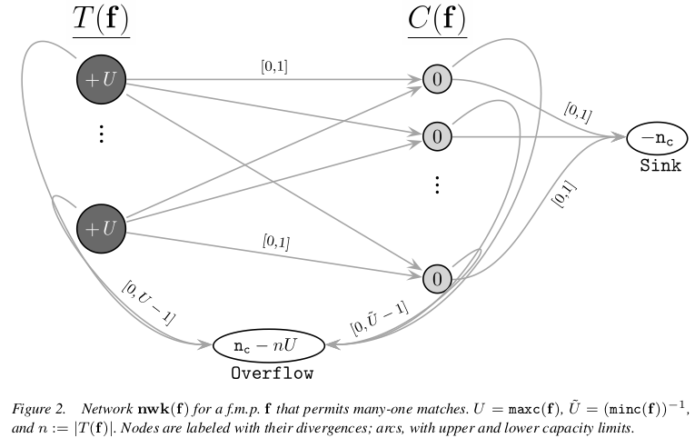

```{r, echo = FALSE}
knitr::opts_chunk$set(collapse = TRUE, prompt=TRUE)
```

# Overview

Optmatch finds optimal matches by translating them to min-cost flow problems (Rosenbaum, 1991, JRSS-B; Hansen and Klopfer, 2006, JCGS), relying on a min-cost flow solver that works by dual ascent.
Through 2018 (version 0.9*), no attempt was made to store the dual problem solution found by this solver; accordingly, it was not possible to use that solution as a starting value for related matching problems.  This document lays out a roadmap for "daylighting" the min-cost flow material, i.e. making it accessible to the R user, for warm starts and supplementary calculations.


## Proximate goals

1.  When solver saw a discretized version of the distance, check whether solution is optimal for matching problem w/ double precision distance (by checking whether primal solution and back-transformed dual solution stand in CS relation to one another). (Cf. issue 160.)
2. Warm starts for MCF problems deriving from same double-precision distance but w/ a different discretization. (Cf. issue 76.)
3. Use dual solution to one problem as warm start for another problem with same arcs, arc costs as in original problem but adding new arcs (between existing nodes).
4. Use dual solution to one problem as warm start for another problem with same arcs, arc costs but adding new arcs and nodes.


## Maybe-later goals

- Flexibly combine subproblem solutions (e.g., distributing subproblems across different cores before combining).
- Merge dual solutions of distinct subproblems, arriving at a possible starting value for a combined subproblem.
- supercede optmatch s3 class, methods with an S4 class, methods.
- Use the dual solution as a basis for computing maxErr / exceedance.

# Classes

## Subproblems / `SubProbInfo`

An `SubProbInfo` is an S4-typed data frame bearing information about (sub)problems passed to the solver, and their translation to and from units acceptable to the solver. Columns:

- `groups`, character (which subproblem?);
- `flipped`, logical (do upstream nodes of MCF representation correspond to _columns_ of match distance matrix, as opposed to rows, the default?);
- `hashed_dist`, character (hashed ID for a double precision distance); 
- `resolution`, double  (multiplier applied to double-precision distance before rounding and handing off to solver); 
-  `lagrangian_value`, numeric (as determined by back-transformed node prices, arc costs and arc flows);
-  `dual_value`, numeric (as determined by back-transformed node prices and arc costs);
- `feasible`, logical.

Rules/conventions:

- this is just a selective record of subproblem specs.
- This type's validity checker should be fast, eschewing expensive operations.
- `feasible` encodes whether the flow-price pair was found to be in a complementary slackness relationship, prior to backtransformation of distances & prices (if applicable).  In other words, `feasible==FALSE` indicates that the subproblem imposed infeasible matching constraints.
- "Upstream" nodes are those to the left in the below diagram (Fig. 2 of Hansen & Klopfer, 2006).  Ordinarily they'll correspond to "the treatment group", i.e. the group indexed by rows of the distance matrix helping to determine the matching problem, but in some situations rows and columns are flipped before being passed to the solver, so that upstream nodes would correspond to columns and downstream nodes to rows. 

   


### `NodeInfo` & subclasses

A `NodeInfo` is an S4-typed data frame bearing the columns:

- `name`, character;
- `price`, double or integer (node prices);
- `upstream_not_down`, logical (node type indicator, see below);
- `supply`, integer; 
- `groups`, factor (name of a subproblem); and
- ... (hold open the possibility of additional columns for subclasses).

Rules/conventions:

-  Coding of node types in `upstream_not_down` column: `TRUE ~` upstream, i.e. "T(**f**)" nodes in Fig. 2 of H.&K. '06, `FALSE ~` downstream or "C(**f**)" nodes in H.&K. '06 Fig. 2; `NA ~`  bookkeeping nodes, e.g. "Overflow" or "Sink" in H.&K. '06 Fig. 2.
-  Multiple subproblems' node information can be combined into a single `NodeInfo` object.
- No two rows can simultaneously have the same values of `name` and `groups`.
- This type's validity checker should be fast, eschewing expensive operations.
- If the solver operated on a transformation of the distance, it's the correspondingly back-transformed node prices that are stored in the `NodeInfo`. 

### `ArcInfo`

An `ArcInfo` has 2 slots:

- `@matches`, data frame with columns
    + `groups`, factor,
    + `upstream`, factor,
    + `downstream`, factor; 
- `@bookkeeping`, data frame with columns
    + `groups`, factor,
    + `start`, factor,
    + `end`, factor,
    + `flow`, integer (nonnegative),
    + `capacity`, integer (nonnegative). 

Rules/conventions:

- In terms of the network flow solution, presence of a row in `@matches` encodes a corresponding flow of 1; absence encodes flow 0.  (So having the row means its `upstream`/`start` node and `downstream`/`end` nodes were matched, absence means not matched.)
- Arcs involving bookkeeping nodes have lower capacity 0, upper capacity `capacity`. Their `flow` values must fall in this range (inclusive of endpoints).
- This type's validity checker should be fast, eschewing expensive operations.
- The `@bookkeeping` d.f. must have a row for each of the bookkeeping arcs of the problem.
- Each (`groups`, `upstream`) pair must appear as a (`groups`, `name`) pair in the NodeInfo table, with `upstream_not_down==TRUE`; each (`groups`, `downstream`) pair must appear as a (`groups`, `name`) NodeInfo  pair, with `upstream_not_down==FALSE`.
- Similarly a (`groups`, `start`) or (`groups`, `end`) pair carried in this table must have in the NodeInfo table a corresponding (`groups`, `name`) entry.   


## Primal-dual solution pairs (`MCFSolutions`)

In practice, current plans call only for passing dual solutions
(arrays of node prices), not also primal solutions (flow vectors),
back to the solver.  But in principle the relax4f solver could
accommodate dual-primal pairs as start values, at the cost of rejiggering our
interactions; see comments to issue 162.  Also assessing CS requires the combo
of a primal and dual solution.   So we'll save both of them, as an S4 object.

Slots for class `MCFSolutions`:

- `subproblems`, a "SubProbInfo" object (see above); 
- `nodes`, a `NodeInfo` object (see above);
- `arcs`, a `ArcInfo` object (see above);
- `matchables`, `MatchablesInfo` object, i.e. an S4-typed data frame with columns
    + `name` (character),
    + `row_unit` (logical),
    + `groups` (factor).

Rules/conventions:

- The `@matchables` table associates nodes to matchable units.
- `row_unit` is `TRUE` for a unit from the rows of a matching distance,
   `FALSE` for a unit from the match distance's columns.  I.e., for
   matchables that appear in the nodes table,
```r
object@subproblems %>%
with(flipped[match(object@nodes$groups,groups)]) %>%
ifelse(!object@nodes$upstream_not_down, object@nodes$upstream_not_down)
```
- There can be matchable units that don't appear in a nodes table, if e.g.
they were excluded prior to matching or their subproblem was found to be infeasible prior to being sent to the solver. 
- `is.na(object@matchables$row_unit)` indicates a unit that's being kept track of but didn't
   have a value for the treatment variable. 
- Checking validity for such an object may be moderately expensive
  when the object is large, as it calls for cross-comparison of
  constituent objects. So e.g. `c()` should not routinely check validity
  on its result; rather the check should be applied to smaller objects. 
- Hold `@.Data`, `@names` and `@levels` slots for likely future use;
  see below notes re future `Optmatch` S4 class.
  


### Subtypes for specific matching problems

Different kinds of matching problem have different bookkeeping nodes, implicit arc capacity constraints etc. Encode all this by declaring appropriate subclasses of `MCFSolutions()`. 

#### `FullmatchMCFSolutions`

A type extending `MCFSolutions()`, w/ characteristics:

- in `@nodes`, exactly 2 `names` values s.t. `is.na(upstream_not_down)`, namely "`(_Sink_)`" and "`(_End_)`";
- in `@nodes`, also each of those appears exactly once per subproblem;
- in `@nodes`, each node with `upstream_not_down == TRUE` has positive `supply`;
- in `@nodes`, each node with `upstream_not_down == FALSE` has `supply==0`;
- in `@nodes`, each node with `is.na(upstream_not_down)` has nonpositive `supply`;
- in `@arcs@bookkeeping`, each node with `!is.na(upstream_not_down)` appears as the `start` of an arc that has end node `(_End_)`;
- in `@arcs@bookkeeping`, each node with `upstream_not_down == FALSE` appears as the `start` of an arc that has end node `(_Sink_)`.

## Return value of `fullmatch` / `pairmatch` (*ptmatch)

### Immediate plan

Return an object bearing S3 class "optmatch", as we did before these changes.
Embed an `MCFSolutions` into it as an attrfibute.

### Final solution

Return object of a new S4 class, `Optmatch`, inheriting from factor as well as from `MCFSolutions`. 

# Methods & Functions

- `as.optmatch()`/`as.factor()` for `MCFSolutions` objects
- `names()`,`names<-` for `MCFSolutions` objects (to pull /set `@matcheables$names)

(Rather than insisting on uniqueness of unit names across subproblems when `c()`-ing together `MCFSolutions` objects, check for non-uniqueness within the `as.optmatch`/`as.factor()` method, suggesting use of `getNamesTable()` and `names<-` to resolve.) 

- `getNamesTable()`: extract `@matchables` table from an `MCFSolutions`.  (¿Also from an optmatch that has an MCFSolutions inside of it?)
- `getMCFSolution()`: extractor for optmatch objects (& later for Optmatch objects)
- `c()` for `MCFSolutions`: `rbind()`s the various consitutent data frames, enforcing req that subproblems have distinct names
- `addArcs()` for `MCFSolutions` objects
- `addNodes()` for `MCFSolutions` objects
